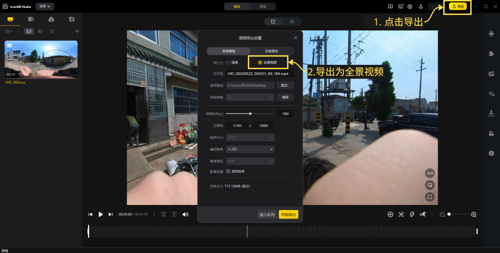
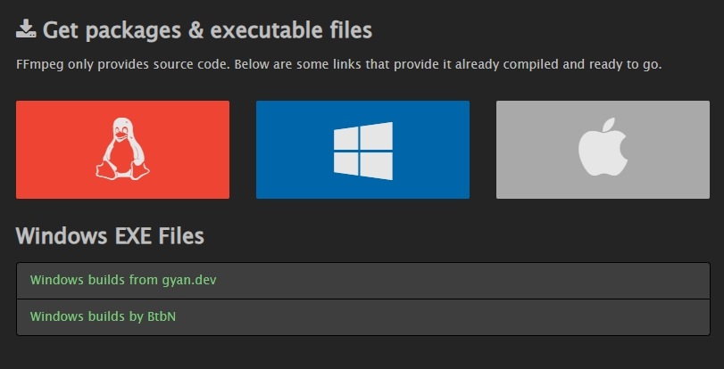
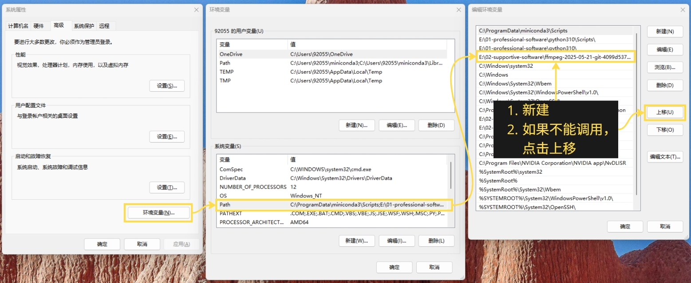
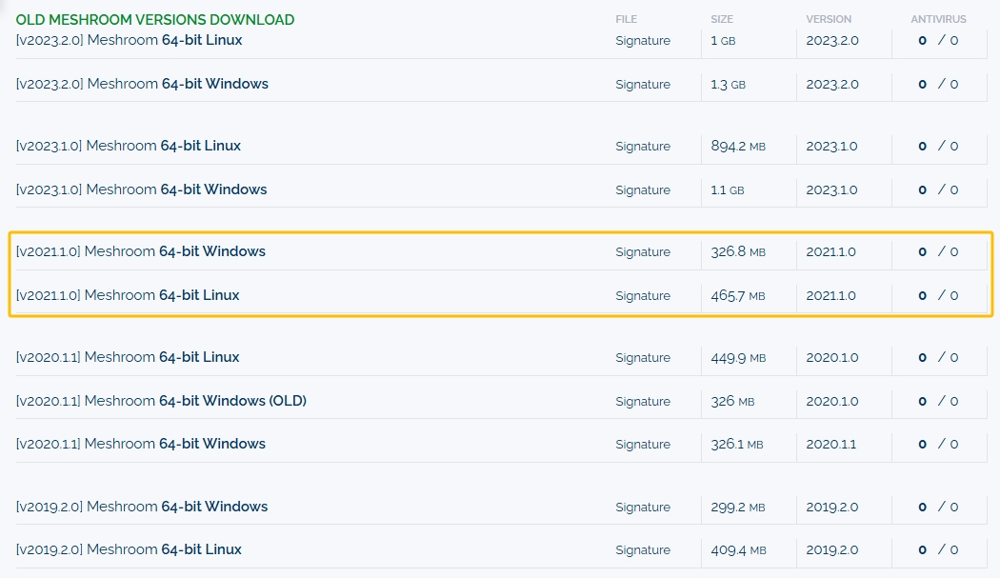

# Summer-Practice-2025

基于全景相机的街道风貌采集指南

---

## 📖 目录

1. [数据采集流程：Insta360 全景 → 8 个方向图片](#数据采集流程insta360-全景--8-个方向图片)

   * [前置准备](#前置准备)
   * [步骤 1：导出 360° 视频](#步骤-1导出-360-视频)
   * [步骤 2：使用 FFmpeg 提取全景照片](#步骤-2使用-ffmpeg-提取全景照片)
   * [步骤 3：使用 AliceVision 拆分成 8 个方向图片](#步骤-3使用-alicevision-拆分成-8-个方向图片)

2. [三维重建：使用 Meshroom 或 Colmap](#三维重建使用-meshroom-或-colmap)

---

## 数据采集流程：Insta360 全景 → 8 个方向图片

### 前置准备

* Insta360 One X 全景相机
* Insta360 Studio 软件（用于 MP4 导出）
* 已安装并添加到系统环境变量 `PATH` 中的 FFmpeg
* Meshroom 2021.1.0

---

### 步骤 1：导出 360° 视频

1. 使用 USB 数据线连接 Insta360 相机与电脑。
2. 启动 **Insta360 Studio**，导入拍摄的原始视频文件。
3. 在导出选项中选择**全景视频**，点击**导出**。

> 

---

### 步骤 2：使用 FFmpeg 提取全景照片

1. **下载 FFmpeg**

   前往 [FFmpeg 官网](https://ffmpeg.org/download.html) 下载适合 Windows 系统的版本，推荐使用 **Windows builds by BtbN**。

   

2. **配置环境变量**

   在 Windows 搜索栏中搜索 "环境变量"，点击**编辑系统环境变量**，将解压后的 FFmpeg 文件夹路径加入系统 `PATH`。

   

3. **提取帧图片**

   在终端（CMD 或 PowerShell）中执行以下命令，提取 JPG 图片帧：

   ```bash
   ffmpeg -i path/to/360_video.mp4 -vf fps=1 -qscale:v 1 path/to/output_folder/image_%04d.jpg
   ```

   > 参数说明：
   >
   > * `fps=1`：每秒提取一帧（推荐设置）。

> **备注：** 以上步骤也可使用 Python 脚本批量调用。

---

### 步骤 3：使用 AliceVision 拆分成 8 个方向图片

**简介：** AliceVision 是 Meshroom 背后的三维重建引擎，提供了一些实用脚本，例如本指南用到的 `aliceVision_utils_split360Images`，用于将全景图拆分成不同方向的平面图。

1. **下载 Meshroom**

   前往 [Meshroom 下载页面](https://www.fosshub.com/Meshroom-old.html) 下载。

   > **注意：请选择下载 Meshroom 2021.1.0 版本！**

   

2. **执行拆分脚本**

   在 PowerShell 中进入 AliceVision 安装目录，执行以下命令：

   ```bash
   aliceVision_utils_split360Images.exe \
   -i path/to/input_360_image_folder \
   -o path/to/output_2D_image_folder \
   --equirectangularNbSplits 8 \
   --equirectangularSplitResolution 1200
   ```

   > **说明：**
   >
   > * 请确保命令行当前目录为 AliceVision 安装根目录。
   > * 输入输出目录需使用绝对路径。

---

## 三维重建：使用 Meshroom 或 Colmap

此部分将在后续更新，敬请关注。

---

📌 如有任何问题或建议，欢迎在 GitHub Issues 中提交反馈！
