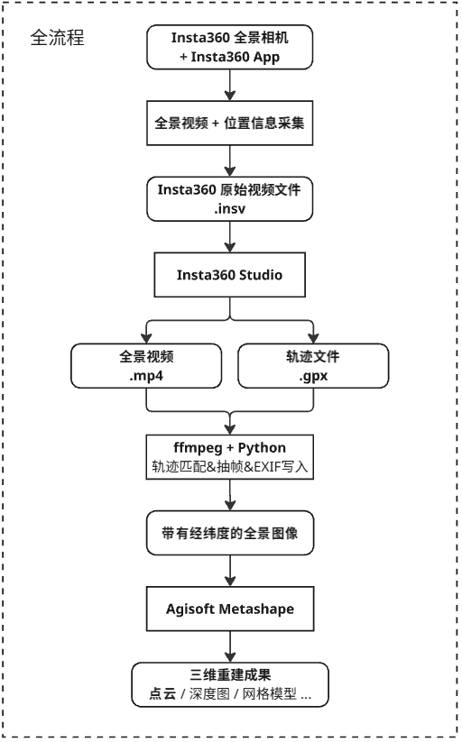
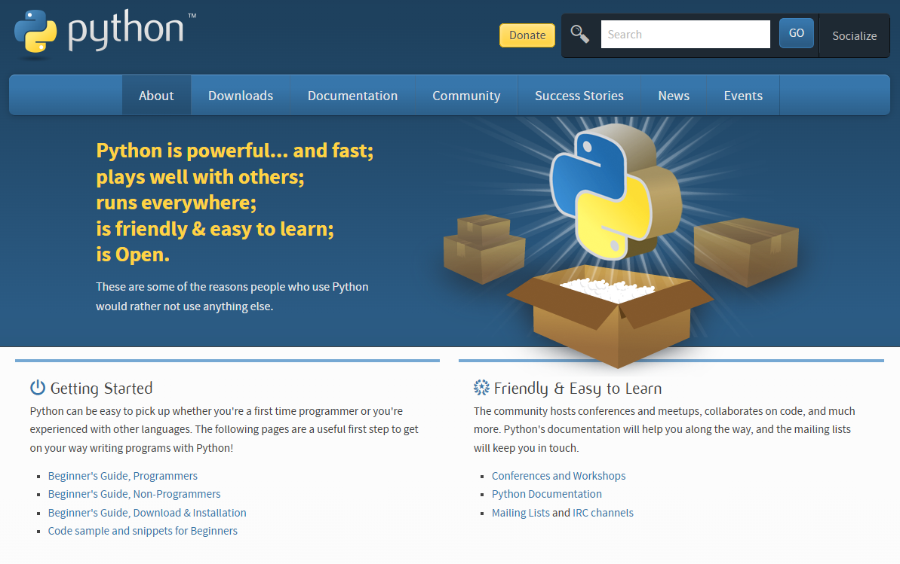
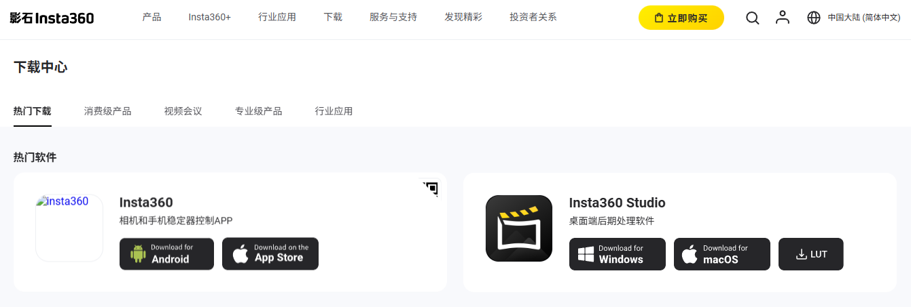
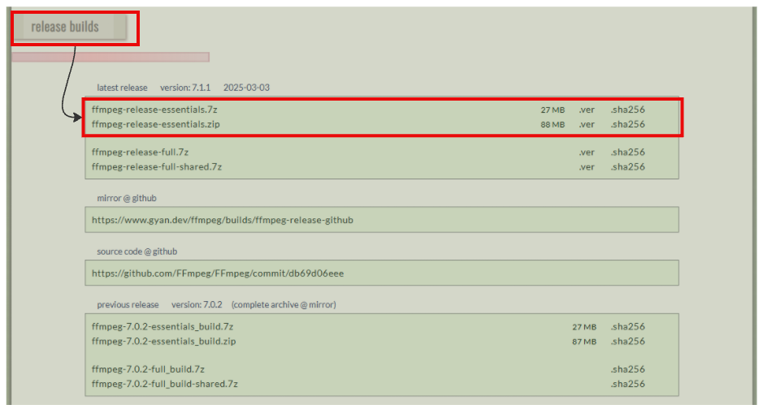

# Summer-Practice-2025

基于全景相机的街道风貌采集指南

---

## 1. 写在最前面：

**这个Github repo用于同济大学2025年暑期实践。“基于全景相机的街道风貌采集指南”**
**目前的课程要求分为两个具体的部分，预实验部分和实景风貌采集建模部分**
**预实验部分的数据采集自同济大学校园内，意在帮助同学们熟悉整个建模的流程，所占分值占本次暑期实践的50%，交付成果是如下所示：**
**实操部分的任务要求同学们在衡复风貌区范围内，任选两条相交的街道，按照完整流程，采集相关的街景影像以及最后的三维成果**

## 📖 目录

> 

1. [课程说明](#1-写在最前面)  
2. [软件安装指南](#软件安装指南)  
3. [全景相机视频采集](#全景相机视频采集)  
4. [全景相机的数据导出](#全景相机的数据导出)  
5. [轨迹匹配&抽帧&EXIF写入](#轨迹匹配&抽帧&EXIF写入)  
6. [三维成果重建](#三维成果重建)  

---

## 软件安装指南：
本次课程需要用到的软件如下所示：

* Python > 3.10
* insta360 Studio
* FFmpeg
* Agisoft Metashape
* AliceVision(可选)

---

### Python 安装

Python 是三维重建中常用的脚本和数据处理工具。

1. 打开 [Python 官方网站](https://www.python.org/downloads/)
   

2. 下载 **3.10 或以上版本**（推荐 3.12）
3. 安装时请勾选 **“Add Python to PATH”**，方便命令行使用
4. 安装完成后，在命令行输入以下命令测试：

```bash
python --version
```

如果能正确显示版本号，说明安装成功。

---

### Insta360 Studio 安装

Insta360 Studio 用于导出相机视频和对应的帧。

1. 打开 [Insta360 Studio 官方下载页面](https://www.insta360.com/cn/download/insta360-studio)
   
2. 根据系统选择 Windows 或 macOS 版本
3. 下载并安装（安装时可能需要设备码，请咨询助教）
4. 打开软件后可导入 `.insv` 文件，并导出视频或图像帧

---

### FFmpeg 安装

FFmpeg 是一个开源的视频处理工具，用于视频转码、抽帧等。

1. 前往 [FFmpeg 官网](https://ffmpeg.org/download.html) 下载适合 Windows 系统的版本，推荐使用 **Windows builds by BtbN**。
   

2. 选择 **"release builds"** 中的 **"ffmpeg-release-essentials"** 下载。
   

3. 解压后，将 `bin` 目录路径添加到系统的 **环境变量 PATH**
   具体的方法如下所示：在 Windows 搜索栏中搜索 "环境变量"，点击**编辑系统环境变量**，将解压后的 FFmpeg 文件夹路径加入系统 `PATH`。
   

4. 完成以上操作后，在命令行中输入：

```bash
ffmpeg -version
```

能显示版本号说明安装成功。

---

### Agisoft Metashape 安装

Metashape 是常用的三维重建软件。

1. 打开 [Agisoft Metashape 官方下载页面](https://www.agisoft.com/downloads/installer/)
2. 下载试用版安装程序
3. 按提示完成安装
4. 启动后可直接试用

---

### AliceVision 安装 (可选)

AliceVision 是一个开源的 SfM/MVS 工具集，也可用于三维重建。

1. 打开 [AliceVision GitHub Releases 页面](https://github.com/alicevision/AliceVision/releases)
2. 下载最新的发布版本并解压
3. 或者安装 **Meshroom**（AliceVision 的图形化前端）：
   - 打开 [Meshroom Releases 页面](https://github.com/alicevision/meshroom/releases)
   - 下载并解压即可使用（免安装）

---


---

## 全景相机视频采集

### 前置准备

* Insta360 One X 全景相机（建议型号x2以上，前文已经提到）
* Insta360 Studio 软件（用于 MP4 导出）
* 已安装并添加到系统环境变量 `PATH` 中的 FFmpeg
* Meshroom 2021.1.0

---

### 步骤 1：全景相机视频采集

1. 使用 USB 数据线连接 Insta360 相机与电脑。
2. 启动 **Insta360 Studio**，导入拍摄的原始视频文件。
3. 在导出选项中选择**全景视频**，点击**导出**。

> 

---

### 步骤 2：使用 FFmpeg 提取全景照片

1. **下载 FFmpeg**

   前往 [FFmpeg 官网](https://ffmpeg.org/download.html) 下载适合 Windows 系统的版本，推荐使用 **Windows builds by BtbN**。

   

2. **配置环境变量**

   在 Windows 搜索栏中搜索 "环境变量"，点击**编辑系统环境变量**，将解压后的 FFmpeg 文件夹路径加入系统 `PATH`。

   

3. **提取帧图片**

   在终端（CMD 或 PowerShell）中执行以下命令，提取 JPG 图片帧：

   ```bash
   ffmpeg -i path/to/360_video.mp4 -vf fps=1 -qscale:v 1 path/to/output_folder/image_%04d.jpg
   ```

   > 参数说明：
   >
   > * `fps=1`：每秒提取一帧（推荐设置）。

> **备注：** 以上步骤也可使用 Python 脚本批量调用。

---

### 步骤 3：使用 AliceVision 拆分成 8 个方向图片

**简介：** AliceVision 是 Meshroom 背后的三维重建引擎，提供了一些实用脚本，例如本指南用到的 `aliceVision_utils_split360Images`，用于将全景图拆分成不同方向的平面图。

1. **下载 Meshroom**

   前往 [Meshroom 下载页面](https://www.fosshub.com/Meshroom-old.html) 下载。

   > **注意：请选择下载 Meshroom 2021.1.0 版本！**

   

2. **执行拆分脚本**

   在 PowerShell 中进入 AliceVision 安装目录，执行以下命令：

   ```bash
   aliceVision_utils_split360Images.exe \
   -i path/to/input_360_image_folder \
   -o path/to/output_2D_image_folder \
   --equirectangularNbSplits 8 \
   --equirectangularSplitResolution 1200
   ```

   > **说明：**
   >
   > * 请确保命令行当前目录为 AliceVision 安装根目录。
   > * 输入输出目录需使用绝对路径。

---

## 视频数据导出与数据处理

---

## 三维重建：使用 Meshroom 或 Colmap

此部分将在后续更新，敬请关注。

---

📌 如有任何问题或建议，欢迎在 GitHub Issues 中提交反馈！
