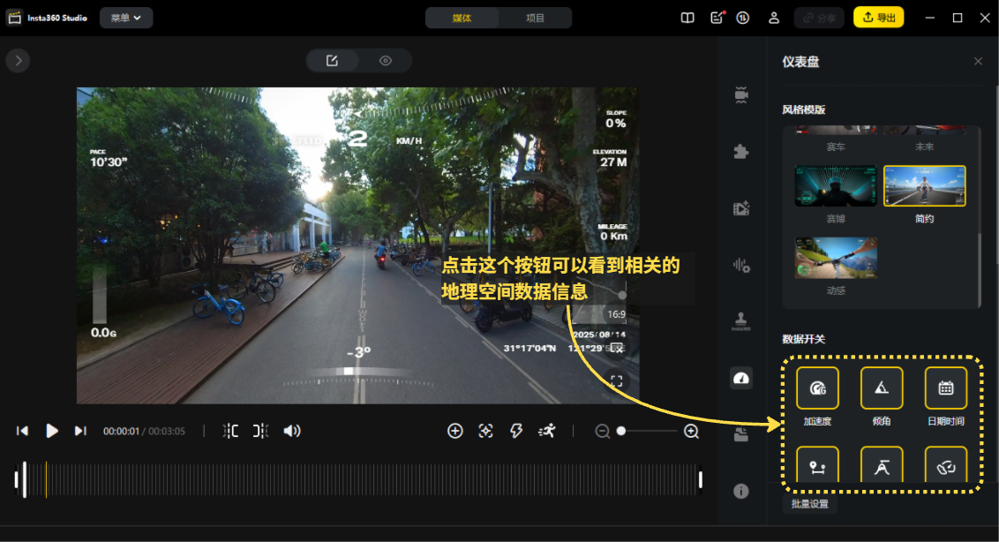
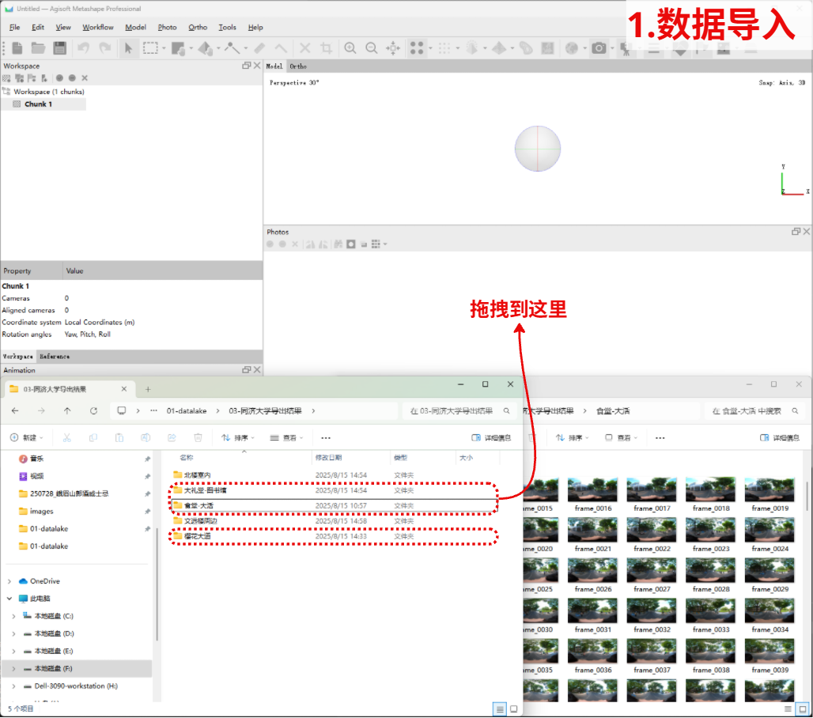
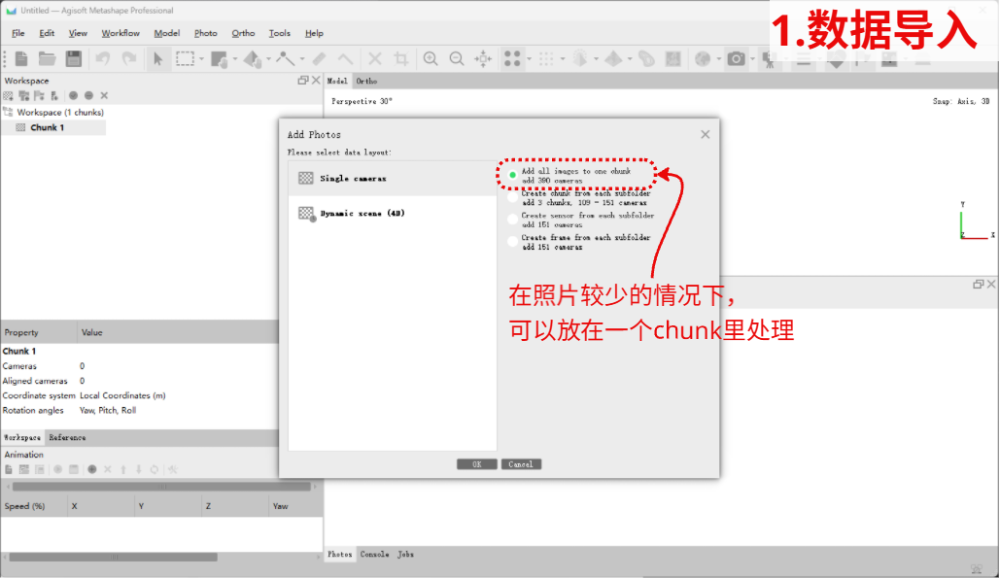

# Summer-Practice-2025

基于全景相机的街道风貌采集指南

---

## 📖 目录

> 

1. [课程说明](#1-写在最前面)  
2. [软件安装指南](#2-软件安装指南)  
3. [全景相机视频采集](#3-全景相机视频采集)  
4. [全景相机的数据导出](#4-全景相机的数据导出)  
5. [轨迹匹配&抽帧&EXIF写入](#5-轨迹匹配&抽帧&EXIF写入)  
6. [三维成果重建](#6-三维成果重建)  
7. [参考资料](#参考资料)  


---

## 1. 写在最前面：

1. 课程说明

**这个Github repo用于同济大学2025年暑期实践。“基于全景相机的街道风貌采集指南”**
**目前的课程要求分为两个具体的部分，预实验部分和实景风貌采集建模部分**
**预实验部分的数据采集自同济大学校园内，意在帮助同学们熟悉整个建模的流程，所占分值占本次暑期实践的50%，交付成果是如下所示：**
**实操部分的任务要求同学们在衡复风貌区范围内，任选两条相交的街道，按照完整流程，采集相关的街景影像以及最后的三维成果**

2. 预实验部分说明
本次预实验是采用同济大学内拍摄的三段原始素材，提供的具体内容有:

 * 学苑食堂 - 大学生活动中心一线（**仅提供.insv原始文件**）
 * 樱花大道 - 瑞安楼一线 （**提供.insv原始文件 以及 导出的全景.mp4文件**）
 * 大礼堂前 - 图书馆后门一线 (**提供.insv原始文件、导出的全景.mp4文件，以及按照GPX提出、匹配EXIF文件的全景图片文件**) 

需要同学们按照以下的步骤，完成以上数据的处理，最后三个数据一起汇总后完成三维重建。

3. 实景采集部分说明

4. 成果考察与打分

---

## 2. 软件安装指南：
本次课程需要用到的软件如下所示：

* Python > 3.10
* insta360 Studio
* FFmpeg
* Agisoft Metashape
* AliceVision(可选)

---

### Python 安装

Python 是三维重建中常用的脚本和数据处理工具。

1. 打开 [Python 官方网站](https://www.python.org/downloads/)
   

2. 下载 **3.10 或以上版本**（推荐 3.12）
3. 安装时请勾选 **“Add Python to PATH”**，方便命令行使用
4. 安装完成后，在命令行输入以下命令测试：

```bash
python --version
```

如果能正确显示版本号，说明安装成功。

5. 安装完成后在你的 Python 环境中安装这次课程所需第三方包：
> 说明：`subprocess`、`datetime`、`fractions`、`pathlib` 都是 **Python 标准库**，**无需安装**；真正需要通过包管理器安装的是 `gpxpy` 和 `piexif`。

```bash
python -m pip install gpxpy piexif
```


---

### Insta360 Studio 安装

Insta360 Studio 用于导出相机视频和对应的帧。

1. 打开 [Insta360 Studio 官方下载页面](https://www.insta360.com/cn/download/insta360-studio)
   
2. 根据系统选择 Windows 或 macOS 版本
3. 下载并安装（安装时可能需要设备码，请咨询助教）
4. 打开软件后可导入 `.insv` 文件，并导出视频或图像帧

---

### FFmpeg 安装

FFmpeg 是一个开源的视频处理工具，用于视频转码、抽帧等。

1. 前往 [FFmpeg 官网](https://ffmpeg.org/download.html) 下载适合 Windows 系统的版本，推荐使用 **Windows builds from gyan.dev**。
   

2. 选择 **"release builds"** 中的 **"ffmpeg-release-essentials"** 下载。
   

3. 解压后，将 `bin` 目录路径添加到系统的 **环境变量 PATH**
   具体的方法如下所示：在 Windows 搜索栏中搜索 "环境变量"，点击**编辑系统环境变量**，将解压后的 FFmpeg 文件夹路径加入系统 `PATH`。
   

4. 完成以上操作后，在命令行中输入：

```bash
ffmpeg -version
```

能显示版本号说明安装成功。

---

### Agisoft Metashape 安装

Metashape 是用于三维重建的软件。

1. 打开 [Agisoft Metashape 官方下载页面](https://www.agisoft.com/downloads/installer/)
   
   
2. 下载专业版安装程序
3. 按提示完成安装
4. 启动后可开启30天试用

---

### AliceVision 安装 (可选)

AliceVision 是一个开源的 SfM/MVS 工具集，也可用于三维重建。

1. 打开 [AliceVision GitHub Releases 页面](https://github.com/alicevision/AliceVision/releases)
   > **注意：请选择下载 Meshroom 2021.1.0 版本！**

   
2. 下载并安装

---

🛠️ 🔧 ⚙️ 🖥️ 💾
---
**现在你已经完成了软件安装的部分，下面我们开始正式的教程部分**🙂
---
🎥 📸 🛰️ 🔍 🏙️
---

---

## 3. 全景相机视频采集
⭐**这一步是预实验步骤**
1. 准备一台insta360相机(x2以及以上型号)
2. 在你的手机上下载 **insta360** APP
3. 手机app连接相机，确保做好以下设置：
> 录像模式
> 分辨率为 5.7k 30fps
> 右上角三个点点击后， GPS功能确保开启
4. 将相机抬举到头顶前上方，开始录制。

以下是图文步骤：

<table>
  <tr>
    <td></td>
    <td></td>
  </tr>
  <tr>
    <td></td>
    <td></td>
  </tr>
  <tr>
    <td></td>
    <td></td>
  </tr>
</table>


---

## 4. 全景相机数据导出
⭐**这一步是预实验步骤**

1. 将数据导入到insta360 studio中


2. 按照以下的参数导出数据:
> 本地导出
> 文件名避免重复
> 码率设置为100
> 分辨率设置为 5760 × 2880
> 编码格式设置为 H.265

3. 得到下一步需要的**全景视频.mp4文件**和拍摄视频时记录的**空间位置信息.gpx文件**

以下是图文步骤：





---

## 5. 轨迹匹配&抽帧&EXIF写入
⭐**这一步是预实验步骤**
1. 打开脚本：
打开这个repo中的 [scripts/](scripts/video2imgs.py) video2imgs.py 文件
2. 修改对应的参数
3. 运行脚本，得到带有exif写入的全景图片（在你之前软件安装的部分应该成功安装了所需要的FFmpeg和相关的Python Packages， 如果失败，请参考[Python 安装](#python-安装)或[FFmpeg 安装](#ffmpeg-安装)）

以下是图文步骤：


---

## 6.1. 三维成果重建
⭐**这一步是预实验步骤**
1. 图片导入
2. 相机矫正
3. 特征匹配
4. 数据清洗
5. 点云重建（三维重建）（深度图重建）

以下是图文步骤 ：





## 6.2. 三维成果重建

1. 图片导入
2. 相机矫正
3. 特征匹配
4. 数据清洗
5. 点云重建（三维重建）（深度图重建）

以下是图文步骤 ：


---
## 参考资料：

---

📌 如有任何问题或建议，欢迎在 GitHub Issues 中提交反馈！
